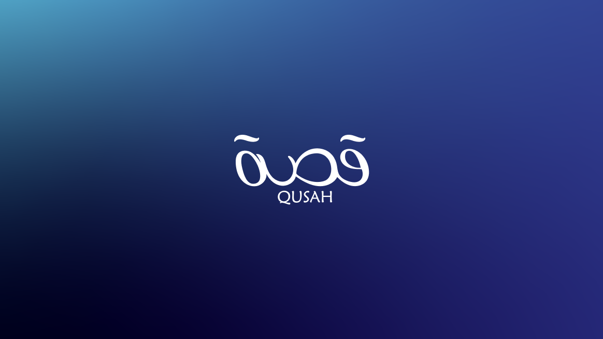

<div id="top"></div>

<div align="center">
  

  <h1 align="center">Qussah Theme — ثيم قصة</h1>

  <p align="center">
    The custom Salla Twilight theme powering <a href="https://qusahstore.com">qusahstore.com</a>
    <br />
    Arabic-first · RTL · built pixel-perfect to Figma
  </p>
</div>

---

## About Qusah — عن قصة

**Qusah (قصة)** is a Saudi home-care and cleaning products brand. The store sells cleaning
and home-supply products direct to consumers across the Kingdom, presenting its range
through curated bundles, timed offers, and category storytelling rather than a plain
catalogue grid.

This repository is the storefront itself — a bespoke theme, not a configured off-the-shelf
one. Every homepage section, the product detail page, cart, and customer pages were built
from a Figma design specific to the brand.

| | |
|---|---|
| **Store** | [qusahstore.com](https://qusahstore.com) |
| **Brand** | Qusah / قصة — home cleaning & care products |
| **Market** | Saudi Arabia · Arabic (RTL) primary, English supported |
| **Platform** | Salla — Twilight theme engine |
| **Repository** | [`Qusah/qussah`](https://github.com/Qusah/qussah) |
| **Base** | `theme-raed` starter, heavily customised |

---

## Design language

| | |
|---|---|
| **Palette** | Deep navy `#30378e` primary · baby-blue `#91e6f7` accent · sale red `#f55157` |
| **Typography** | **GE SS Two** (Arabic) + Poppins (Latin numerals) |
| **Direction** | RTL-first — LTR is the fallback, not the default |
| **Design source** | Figma — desktop frame @1440px, mobile frame @428px |

Fonts are **base64-embedded** in `src/assets/styles/01-settings/fonts.scss`. External font
paths return 410 inside the Salla editor, so they must stay embedded.

---

## What's custom here

**22 bespoke homepage sections**, each merchant-editable from the Salla dashboard:

| Section | Component | Section | Component |
|---|---|---|---|
| Hero | `qissa-hero` | Stats strip | `qissa-stats` |
| Brand story | `qissa-story` | Factory showcase | `qissa-factory` |
| Brand values | `qissa-values` | Feature banner | `qissa-feature-banner` |
| Categories | `qissa-categories` | Media / press | `qissa-media` |
| Featured products | `qissa-products` | Testimonials | `qissa-testimonials` |
| Offers + countdown | `qissa-offers` | Influencer reviews | `qissa-video-reviews` |
| Bundle package | `qissa-package` | Trust badges | `qissa-trust-badges` |
| Dual product hero | `qissa-dual-hero` | Newsletter | `qissa-footer-newsletter` |
| Dual product standard | `qissa-dual-standard` | Banner | `qissa-banner` |
| All products | `qissa-all-products` | Video banner | `qissa-video-banner` |
| Product listing | `qissa-listing` | Highlight cards | `qissa-highlight-cards` |

**Beyond the homepage** — rebuilt product detail page, cart, wishlist, notifications,
customer account layout, header with mega-menu, and a footer carrying payment methods and
the legal entity / CR trust line.

---

## Tech stack

| | |
|---|---|
| **Engine** | Salla Twilight (Twig templates) |
| **Styling** | SCSS in ITCSS layers + Tailwind via `@apply` |
| **Build** | webpack 5 · sass · postcss · Babel |
| **Runtime** | Node 24.x · pnpm 11.x |

---

## Project structure

```
src/
├── views/
│   ├── layouts/            master.twig · customer.twig
│   ├── components/
│   │   ├── home/           the 22 qissa-* homepage sections
│   │   ├── header/         header.twig
│   │   ├── footer/         footer.twig
│   │   └── partials/       shared fragments
│   └── pages/              product · cart · blog · brands · customer/*
├── assets/
│   ├── styles/
│   │   ├── 01-settings/    tailwind · fonts (base64) · globals · breakpoints
│   │   ├── 02-generic/     reset · common · rtl · ltr · animations
│   │   ├── 03-elements/    forms · buttons · radios
│   │   ├── 04-components/  qissa-*.scss — one per section
│   │   └── 05-utilities/   chat bots · swal · safari fixes
│   └── js/                 app · product · cart · home + partials
└── locales/                ar.json · en.json
twilight.json               component + settings registration
```

---

## Getting started

```bash
pnpm install
pnpm run development      # build + watch
pnpm run production       # minified production build
```

> **`public/app.css` is committed.** SCSS does not compile on commit — rebuild and commit
> the compiled file or your styles will not appear in preview.

### Preview

```bash
salla theme preview
```

- **SCSS change** → hard refresh (Cmd+Shift+R)
- **Twig or `twilight.json` change** → restart `salla theme preview`; it only re-syncs
  committed files on a fresh run

The Salla **editor canvas** renders only the page body — no header, footer, or master
layout. Test those on the store preview URL.

### Releasing

Pushing to GitHub does **not** deploy. Publish a new theme version in Salla for changes to
reach the live store.

---

## Adding a homepage section

Three files plus one registration:

```
src/views/components/home/<name>.twig           # markup
src/assets/styles/04-components/<name>.scss     # styles
src/assets/styles/app.scss                      # @import line
twilight.json                                   # register with a fresh UUID key
```

```bash
node -e "console.log(crypto.randomUUID())"      # component key — must be a valid UUID
```

Read merchant fields as `{{ component.fieldId }}`, not bare `{{ fieldId }}`.

See [`DEVELOPER_GUIDE.md`](DEVELOPER_GUIDE.md) for field schemas, the product-dropdown
config, and the full list of platform gotchas.

---

## Conventions

- **Class prefix** — every custom section uses a `q`-prefixed BEM root (`qhero`, `qcats`,
  `qprod`, `qoffer`, `qpack`) to stay isolated from starter-theme styles.
- **Commits** — clear, present tense. This is a production theme.
- **Match the surrounding code** — comment density, naming, idiom.

---

## Analytics & experimentation

VWO loads from the top of `<head>` in `master.twig`, deliberately placed **before**
`app.css` so its anti-flicker snippet can hide the page until variations resolve. Keep it
first in the head — moving it below the stylesheet reintroduces variant flicker and skews
A/B results.

---

<div align="center">
  <sub>Built for <a href="https://qusahstore.com">Qusah — قصة</a> on Salla.</sub>
</div>
